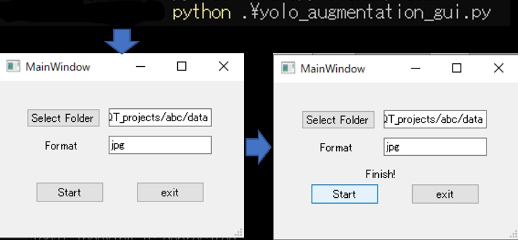

# YOLO augmentation

## Description

Reinventing The Wheel?!!!!

I'm using [Yolo_Label](https://github.com/developer0hye/Yolo_Label) to label object.

 I do augmentation for YOLO training, but I didn't want to do labeling work after the augmentation. This program greatly reduces the work by padding the txt file as well as padding the image. The default is to inflate 24 times the image.

## Requirement

- Python3.6 or later (Windows10, Ubuntu)
- OpenCV3 or later

## Usage(CUI)

- Image is from https://github.com/developer0hye/Yolo_Label. Suppose the file is already labeled.

- Execute the following command.

   `$ python3 yolo_argmentation.py -p <path> -f jpg`
   
   For example : `python3 yolo_argmentation.py -p data`

- Augmented files will be generated.

- This is a diagram of the program's algorithm.

- The name rules after program execution are as shown in the image below. (e.g. raccoon_1.jpg)

## Usage(GUI)

- Dependent of PyQt5

- Execute this command to start program. `python3 yolo_argmentation_gui.py`

- Press "Select Folder" button to select the target image folder.

- Press "Start" button to start process.(Progress bar on the terminal.)
-  The word "Finish" will appear when the process ends

## Options(For CUI)

- -h or --help : Show help
- -f or --format : Specify files format. (default : jpg)
- -p or --path : Specify the folder path where the file to be read is located. (default : None)

## License

MIT : https://github.com/Ar-Ray-code/yolo_augmentation/blob/main/LICENSE
